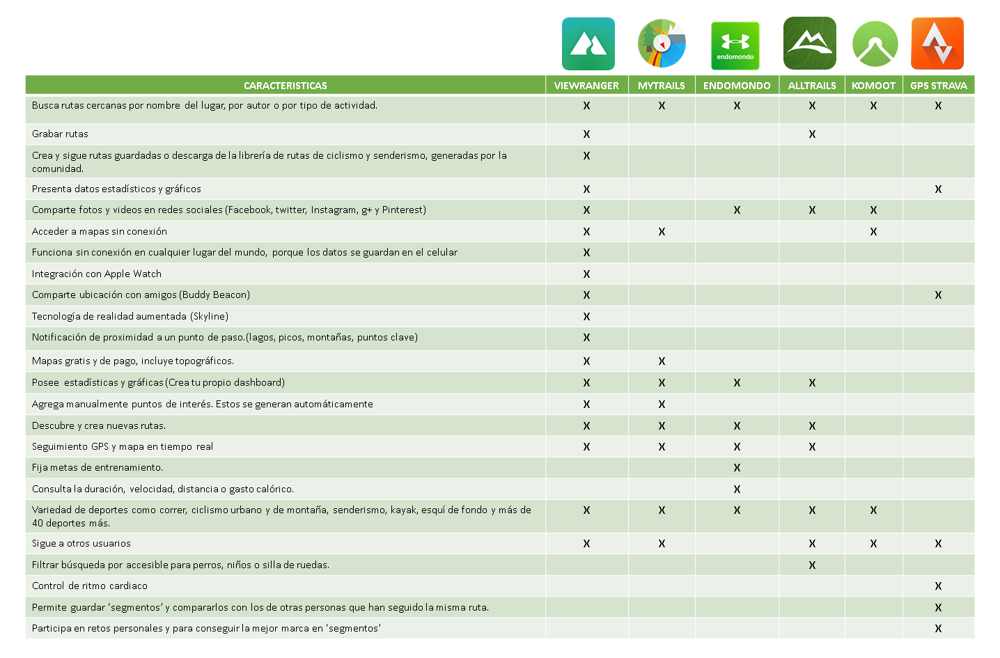
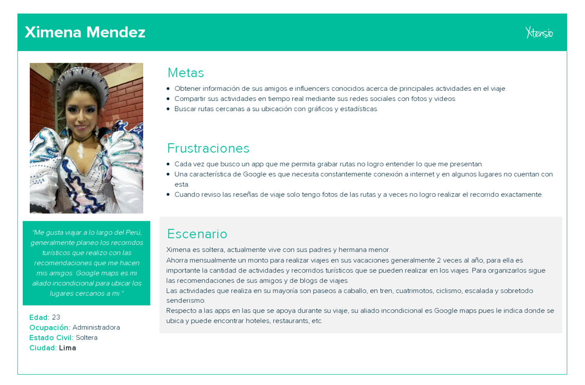

# Here Maps

Es una aplicación móvil que permita a los usuarios trackear y monitorear recorridos que se realice en senderos al aire libre/outdoor, orientada a los amantes de las actividades de aventura (montañas, lagos, parques, etc.) en Perú.
Esta app permite buscar rutas cercanas, grabarlas y compartir fotos, videos en tiempo real. Además de acceder a mapas sin conexión y compartir tu ubicación en tiempo real.

## Desarrollado para
 [Here maps](https://www.here.com/en)

### **EXPERIENCIA EN EL USO DE APPS DE MONITOREO Y TRACK DE RECORRIDOS**

### **Contexto**

### **Idea de negocio**

### **Público Objetivo**
Jóvenes entre 18 y 28 años que viajan al menos una vez al año y realizan recorridos en sus viajes.

### **Plan propuesto de investigación**

#### **Objetivo de la investigación:**
Identificar las variables que determinan el uso de apps de monitoreo de recorrido por los jóvenes que viajan regularmente además de obtener información acerca de como planean las actividades que realizan en sus viajes.
#### **Objetos a investigar:**
- Apps de turismos.
- Jóvenes que viajan entre 18 y 28 años.
#### **Técnicas a utilizar:**
- Encuestas online
- Entrevistas a profundidad
- Testing de apps
- Benchmark

### **Planner del proyecto**
https://trello.com/b/eUD31zlB/here-maps
### **Proceso de diseño**

### **DESCUBRIMIENTO E INVESTIGACIÓN**
### **Recopilación y análisis de datos**
#### **Encuestas online**
Realizamos encuestas online a 25 personas con las siguientes preguntas:
1. _**Edad:**_
2. _**Sexo**_  
3. _**¿A qué te dedicas?**_  
4. _**¿Cuál es motivo principal por el que viajas?**_
5. _**¿Cuántas veces al año realiza un viaje?**_
6. _**¿Que tan importante es la variedad de actividades al escoger tu destino?**_
7. _**¿ Qué actividades sueles realizar en tus vacaciones?**_
8. _**¿Cuál es tu destino para vacacionar preferido? En el caso que hayas visitado el Perú ¿Podrías indicarnos algún lugar en especial?**_
9. _**¿Cuál de las siguientes opciones usas con más frecuencia cuando viajas?**_
10. _**Marca las actividades que hayas realizado en tus viajes al menos una vez**_
11. _**Si marcaste alguna de las opciones anteriores, como organizaste esas actividades**_
12. _**¿Alguna vez has experimentado algún inconveniente al realizar estas actividades? Si es así, mencionalo.**_
13. _**¿Conoces algunas de estas apps de rutas?**_
14. _**¿Cuéntanos tu experiencia respecto a las apps que empleaste?**_

El cuestionario se encuentra en el siguiente link: https://goo.gl/forms/eyfHsOQst4SsXFVu2

Los resultados del estudio se encuentran en: https://drive.google.com/file/d/1GmlfXrcV22nbojDt8mURNBMBb_QW51nI/view?usp=sharing 

#### **Entrevistas a profundidad**
Se realizaron entrevistas a profundidad con 6 personas a las cuales se les aplicó el siguiente cuestionario:

- **Building Rapport**

1. 	Por favor, me indicas tu nombre.
2.	Podría indicarme tu edad.
3.	¿Qué tal? ¿Cómo estuvo tu día hoy?
4.	Cuéntame sobre ti. ¿Cómo te defines? ¿Con quienes vives? ¿Qué haces cuando tienes tiempo libre?
5.	¿A qué te dedicas actualmente? (Trabajas, estudias, ambas)

- **Preferencias al viajar**
6. ¿Cuál es motivo principal por el que viajas? (Trabajo, estudios, visitas familiares)
7. ¿Cuántas veces al año realiza un viaje?
8. ¿Es importante la variedad de actividades al escoger tu destino?¿Por qué?
9. ¿ Qué actividades sueles realizar en tus vacaciones? (Deportes de aventura, recorridos turisticos, tours culturales)
10. ¿Cuál es tu destino para vacacionar preferido? ¿Algún departamento del Perú en especial? ¿Por qué?
- **Planning de viajes**
11. ¿Qué apps empleas generalmente cuando viajas? (Google Maps, redes sociales, app de rutas) ¿Para qué las empleas?
12. ¿Cuales son  las actividades que hayas realizado en tus viajes al menos una vez
13. ¿Con qué organizaste estas actividades ?
14. ¿Por qué las organizaste de ese modo?
15. ¿Alguna vez has experimentado algún inconveniente al realizar estas actividades? Si es así, mencionalo.

- **Conocimiento de apps**
16. ¿Conoces Wikiloc? ¿Para qué la has empleado?
17. Presentar wikiloc e indicarle las tareas (Grabar ruta, clasificarla según actividad, explorar rutas alternas)

- Los audios y videos de las entrevistas se encuentran en el siguiente link: https://drive.google.com/drive/folders/1YPkveBsqUj5OSWa31gtMmR662HzrXJXV?usp=sharing

#### **Test - Wikiloc**
- Se realizo el test de la aplicación con 2 personas que viajan constantemente alrededor del mundo.
- Se les brindo una lista de tareas entre ellas:
1. Empezar a grabar una ruta.
2. Publicar una foto de la ruta que esta realizando.
3. Explorar algunas rutas cercanas.
4. Elegir una ruta a su alrededor.
5. Describir los elementos que conforman la ruta.
6. Finalizar la ruta que esta realizando.

- Los videos del test se encuentran en el siguiente link: https://drive.google.com/drive/folders/1YPkveBsqUj5OSWa31gtMmR662HzrXJXV?usp=sharing

#### **Benchmark**
Se realiza un benchmark con nuestros principales  modelos a seguir:

### **Resultados de la investigación**
1. Los entrevistados generalmente trabajan y estudian, ahorrar por un determinado tiempo para planificar sus viajes una o dos veces al año.
2. El principal motivo por el que realizan viajes es turismo con un 62% seguido de visitas familiares con un 18%.
3. Para los viajeros es importante la variedad de actividades que se pueden realizar en los viajes.
4. Las actividades que se realizan generalmente son recorridos turísticos (visitas gastronómicas, culturales e historicas) además de visitar festividades típicas del lugar.
5. Google maps y las redes sociales con reseñas de viajes son las opciones más consultadas al momento de planear y durante el viaje.
6. Las actividades/deportes que se realizan en los viajes son: el paseo en tren, paseo a caballo, paseo en cuatrimotos, natación, ciclismo, escalada y senderismo.
7. Al momento de realizar las actividades descritas anteriormente las planean por su cuenta empleando Google Maps generalmente y no han tenido inconvenientes cuando las realizaban.
8. El 88% de los encuestados no conocen ninguna aplicación que permita trackear y monitorear recorridos.
9. La recomendación de amigos juega un papel muy importante al momento de planear un viaje pues esto les genera mayor confianza.
10. Los principales destinos turisticos para visitar son las montañas y evitan quedarse en ciudades grandes.
11. Una de las actividades que tambien se realiza de manera usual es tomar fotografías para compartirla en las redes sociales.
12. Respecto al test de wikiloc la app es entendible en su mayor parte al elegir la actividad a realizar, grabar la ruta, explorar rutas cercanas,visualizar los detalles estadisticos de las rutas, revisar recomendaciones, elegir una ruta cercana.
13. Ellos desearían visualizar en una app recomendaciones de sus amigos los cuales han realizado la ruta cercana y estarían más prestos a seguir estas rutas.
14. Las características de wikiloc que no quedaron muy claras o que no logran inferirse son la cámara de fotos, ellos prefieren elegir una ubicación en el mapa y tomar la foto.
15. Al realizar el comparativo con las principales apps las características que destacaron son: la búsqueda de rutas cercanas y que permita grabarlas, presentación de datos estadísticos y gráficos de las rutas, compartir fotos y videos en redes sociales (Facebook, twitter, Instagram, g+ y Pinterest),acceso a mapas sin conexión, compartir ubicación en tiempo real (buddy beacon),tecnología de realidad aumentada (skyline), seguir a otros usuarios, registrar variedad de deportes y el filtrado de búsqueda para perros, niños o personas en silla de ruedas.

### **SÍNTESIS Y DEFINICIÓN**

### **User persona**
#### **User persona primario**
 

### **Problems Statements**
1. Ximena **necesita** buscar rutas cercanas  **para** explorar lugares en los recorridos que realiza sus viajes.
2. Ximena **necesita** revisar blogs y recomendaciones **para** planear recorridos en sus viajes.
3. Ximena **necesita** recorrer las rutas más recomendadas **para** realizarlas y disfrutar más del Perú.
4. Ximena  **necesita** una aplicación   **para** grabar sus recorridos más importantes y recomendarlos.
5. Ximena **necesita** tomar fotos y videos de sus recorridos  **para** compartirlos en sus redes sociales en tiempo real.
6. Ximena  **necesita** acceder a mapas sin conexión  **para** ubicarse de mejor manera en sus recorridos.
7. Ximena **necesita** compartir su ubicación en tiempo real **para** que sus familiares y amigos tengan conocimiento en donde esta.
8. Ximena **necesita** ubicar cajeros, restaurantes y puntos de paso  **para** planear de mejor forma sus rutas.

### **How Might We? (HMW)**
1. **HMW** mostrar las rutas cercanas a nuestro punto de ubicación ?
2. **HMW** indicar los blogs y reseñas más recomendados de las rutas cercanas ?
3. **HMW** grabar los recorridos de nuestros viajes para recomendarlos?
4. **HMW** capturar fotos y videos de nuestros recorridos cuando realizamos las actividades ?
5. **HMW** compartir la ubicación en tiempo real y que nuestros famiiares y conocidos puedan verlos?
6. **HMW** ubicar puntos importantes en el recorrido cada vez que los necesitemos?
7. **HMW** compartir los videos y fotos en nuestras redes sociales?
8. **HMW** acceder a mapas sin conexión?

### **What if?**
1. **What if** no mostramos rutas cercanas solo el punto de ubicación?
2. **What if** añadimos comentarios de las rutas cercanas y los puntuamos con estrellas?
3. **What if** grabamos los recorridos y los almacenmos en la nube directamente?
4. **What if** no tomamos fotos desde la aplicación y solo compartimos las predeterminadas?
5. **What if** no necesitamos compartir nuestra ubicación en tiempo real porque todas las rutas son seguras?
6. **What if** los puntos importantes estan indicados en los caminos de las rutas a realizar?
7. **What if** no comparitmos fotos y videos en las redes sociales?
8. **What if** los mapas se pueden acceder sin conexión cuando los descargamos?

### **IDEACIÓN**
### **Feature List**
1. Búsqueda de rutas cercanas.
2. Grabar las rutas que se este realizando en tiempo real.
3.  Presentación de datos estadísticos y gráficos de las rutas.
4. Compartir fotos y videos en redes sociales (Facebook, twitter, Instagram, g+ y Pinterest).
5. Acceso a mapas sin conexión mediante su descarga.
6. Compartir ubicación en tiempo real (buddy beacon).
7. Seguir a otros usuarios, comentar su actividad y puntuarlas.
8. Tecnología de realidad aumentada (skyline)
9. Registrar variedad de deportes y actividades que se puedan realizar para guardarlas.
10. Filtrado de búsqueda de lugares accesibles para perros, niños o personas en silla de ruedas.
### **Priorización**
1. Búsqueda de rutas cercanas.
2. Grabar las rutas que se este realizando en tiempo real.
3.  Presentación de datos estadísticos y gráficos de las rutas.
4. Compartir fotos y videos en redes sociales (Facebook, twitter, Instagram, g+ y Pinterest).
5. Acceso a mapas sin conexión mediante su descarga.
6. Compartir ubicación en tiempo real (buddy beacon).
7. Seguir a otros usuarios, comentar su actividad y puntuarlas.

8. Registrar variedad de deportes y actividades que se puedan realizar para guardarlas.

### **PROTOTYPING**  

#### **Paper prototyping - versión 1**
https://marvelapp.com/32i6j87/screen/40514561

#### **Prototipo de alta fidelidad**
https://marvelapp.com/32j9ic5/screen/40552711
### **TESTING**
#### **Primer testing - paper prototyping**
Se realizó el testing con 3 personas a las cuales se les contextualizo en un escenario y se les brindo una lista de tareas a realizar.

- _**Tareas a realizar**_ 
1. Elegir una ruta
2. Buscar lugares cercanos.
3. Grabar una ruta.
- _**Feedback**_ 
1. Al dar clic en planear se esperaba un calendario de actividades para colocar las fechas de viaje o algo así.
2. Se debe elegir la ruta al momento de dar clic en destino
3. Al elegir la reseña de lurin pensé que me apareceria alguna información estadisticas o datos del lugar.
4. Les parece muy interesante que le dé señales de lugares cercanos a su ubicacion.
5. El botón de grabar ruta deberia diferenciarse del elegir actividad es decir que esten separadas esas acciones.
6. Llamó su interes los datos estadisticos que le brinda la actividad.
7. Pensó que la imagen de explorar y la lupa llevaban a lo mismo.
8. Esperaban ver info de su perfil al dar clic en el icono del user.
9. Pensaron que en rutas saldrian recorridos recomendados.
10. Le hubiera gustado entrar con la opción de facebook
11. Les gusta que al ingresar el destino en la opción rutas, le aparezca la ruta que debe tomar
12. Les parece práctico que le muestre lugares cercanos a su ruta.
13. Quisieran poder explorar más rutas en la opción de planear.
14. No entendieron a qué se refería con las reseñas.
15. Le parece práctico para buscar rutas
16. La encuentra muy similar a otras aplicaciones de rutas
17. Les gustaría que hubiera algo que la diferencie o un plus (no específica que)

#### **Segundo testing**
Se realizó el testing con 2 personas a las cuales se les contextualizo en un escenario y se les brindo una lista de tareas a realizar.
- _**Tareas a realizar**_ 
- _**Feedback**_ 

### **CONCLUSIONES**

#### **Tecnología a emplear**

#### Tipo de APP
- Nuestro producto es una aplicación nativa.

- La elección fue hecha a raíz de que la mayoría de nuestros usuarios  usan sus dispositivos celulares todo el tiempo para estar conectados y para realizar sus rutas cada vez que viajan y también porque se quiere aprovechar ciertas capacidades como del sistema operativo,GPS, apps incorporados, etc.

### APIS y SDK
- Para la visualización del mapa o el Display Map, usar el siguiente Feature “INTERACTIVE
MAPS” ( https://developer.here.com/documentation/android-starter/topics/maps.html o
https://developer.here.com/documentation/ios-starter/topics/maps.html ).
- Para la opción grabar recorrido, recomendamos el Feature “POSITIONING”
(https://developer.here.com/documentation/android-starter/topics/mappositioning.html).
- Para poder encontrar lugares que se encuentran alrededor de mi posición recomendamos
usar el Feature “PLACES” (https://developer.here.com/documentation/androidstarter/topics/places.html
).
- Para poder reportar errores en el mapa, falta de información o sugerencias puedes usar el
siguiente Feature “MAP FEEDBACK”
(https://developer.here.com/documentation/embedded-editor/topics/add-as-appcomponent.html
).
- Para poder darle la ruta a tomar si encuentra un lugar cercano, utilizar el siguiente Feature
“ROUTING” (https://developer.here.com/documentation/android-starter/topics/routingstarter.html
).
- Si se desea consultar el tiempo climático del lugar donde se encontrará una semana antes,
utilizar el siguiente Feature “Weather”
(https://developer.here.com/documentation/weather/topics/example-seven-dayweather-forecast.html
).

